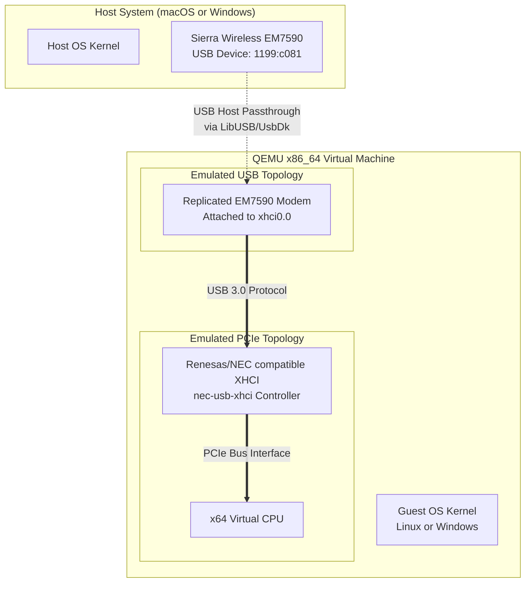

# QEMU IaC Replication: x64, Renesas uPD720202 & Sierra Wireless EM7590

This repository provides a self-contained, Infrastructure-as-Code (IaC) procedure to replicate an **x64 guest system** containing a **Renesas uPD720202 USB 3.0 Controller** and a **Sierra Wireless EM7590 LTE Modem** passed through from the host.

This configuration is designed to function seamlessly on both **macOS** (Intel/Apple Silicon) and **Windows** hosts.

---

## 1. System Architecture

The following diagram illustrates how the host hardware and QEMU hypervisor map physical and emulated components into the guest system:



### Component Mapping Details

| Physical Target Device | QEMU Emulation / Passthrough Strategy | PCI / USB Identifiers | Notes |
| :--- | :--- | :--- | :--- |
| **x64 CPU Architecture** | Native x86_64 CPU emulation or hardware acceleration. | `-machine q35` | Uses `hvf` on Intel macOS, `whpx` on Windows, and `tcg` software translation on Apple Silicon. |
| **Renesas uPD720202 Controller** | Emulated NEC/Renesas XHCI USB 3.0 controller (`nec-usb-xhci`). | Vendor ID: `0x1033`<br/>Device ID: `0x0194` | QEMU emulates the µPD720200 controller, which shares the exact same kernel driver stack (`xhci_hcd`) as the uPD720202. |
| **Sierra Wireless EM7590 LTE Modem** | Direct USB Host Passthrough mapped to the `nec-usb-xhci` controller. | Vendor ID: `0x1199`<br/>Product ID: `0xc081` | Dynamically captured from host and attached to the VM. |

---

## 2. Repository Structure

- [vm_config.env](file:///Users/denismaggiorotto/Documents/Progetti/Sunnyvale/OpenSource/repos/renesas-sierra/vm_config.env): Centralized configuration file declaring VM hardware attributes (CPU, RAM, Disk) and modem Vendor/Product IDs.
- [launch.sh](file:///Users/denismaggiorotto/Documents/Progetti/Sunnyvale/OpenSource/repos/renesas-sierra/launch.sh): Shell script orchestrator for macOS and Linux hosts. Handles dynamic CPU architecture detection (Intel vs. Apple Silicon) and privilege escalation.
- [launch.ps1](file:///Users/denismaggiorotto/Documents/Progetti/Sunnyvale/OpenSource/repos/renesas-sierra/launch.ps1): PowerShell orchestrator for Windows hosts. Manages UsbDk service validation, active device detection, and self-elevation.

---

## 3. Host Prerequisites

### macOS Hosts
1. Install **Homebrew** (if not already installed) from [brew.sh](https://brew.sh).
2. Install QEMU:
   ```bash
   brew install qemu
   ```

### Windows Hosts
1. Download and run the QEMU installer for Windows from the [QEMU official website](https://www.qemu.org/download/#windows). Make sure to add `qemu-system-x86_64.exe` to your system's Environment Variables (PATH).
2. Download and install **UsbDk (USB Development Kit)** from the [SPICE space page](https://www.spice-space.org/download/windows/usbdk/). This driver is required for QEMU to claim USB devices from the Windows kernel.

---

## 4. Execution Guide

### macOS / Linux
To start the VM or install an OS, use the following bash commands:

```bash
# View command help options
./launch.sh --help

# Run a Dry Run to verify generated QEMU options
./launch.sh --dry-run

# Boot VM and mount an installation ISO
./launch.sh --iso /path/to/operating-system-install.iso

# Boot VM in background (detached mode)
./launch.sh --background
```

> [!IMPORTANT]
> **Privilege Elevation**: If the Sierra Wireless EM7590 is detected on the host USB bus, the script will automatically invoke `sudo` to gain raw access to the USB subsystem.

---

### Windows (PowerShell)
Open an elevated PowerShell window or run the script directly:

```powershell
# Run a Dry Run to output QEMU command line arguments
.\launch.ps1 -DryRun

# Boot VM and mount an OS installation media
.\launch.ps1 -IsoPath C:\path\to\operating-system-install.iso

# Run the VM in the background (hidden console window)
.\launch.ps1 -Background
```

> [!IMPORTANT]
> **Administrator Privileges**: Direct USB passthrough on Windows using UsbDk requires Administrator privileges. If run as a standard user while the modem is connected, the script will request permission to elevate itself automatically.

---

## 5. Guest Operating System Verification

Once your guest OS (Linux/Windows) is booted, verify the architecture replication:

### Verification in a Linux Guest

1. **Verify XHCI USB Controller (Renesas/NEC Emulation)**:
   Run `lspci` to verify the PCIe device lists:
   ```bash
   lspci -nnk | grep -i xhci
   ```
   *Expected Output:*
   ```text
   00:1d.0 USB controller [0c03]: NEC Corporation uPD720200 USB 3.0 Host Controller [1033:0194] (rev 03)
       Kernel driver in use: xhci_hcd
   ```

2. **Verify USB Modem Attachment**:
   Check if the Sierra Wireless EM7590 is registered on the USB topology:
   ```bash
   lsusb -t
   ```
   *Expected Output showing the modem connected to the NEC XHCI controller:*
   ```text
   /:  Bus 02.Port 1: Dev 1, Class=root_hub, Driver=xhci_hcd/4p, 5000M
       |__ Port 1: Dev 2, If 0, Class=Vendor Specific Class, Driver=qmi_wwan, 480M
       |__ Port 1: Dev 2, If 1, Class=Vendor Specific Class, Driver=option, 480M
   ```

3. **Verify LTE Modem Interfaces**:
   Run `ip link` or `nmcli` to verify QMI/MBIM interfaces:
   ```bash
   ip link show
   ```
   *Verify if `wwan0` or `wwan1` is generated.*

---

### Verification in a Windows Guest

1. Open **Device Manager** (`devmgmt.msc`).
2. Expand **Universal Serial Bus controllers**:
   - You should see the **Renesas USB 3.0 eXtensible Host Controller**.
3. Expand **Network adapters** or **Ports (COM & LPT)**:
   - You should see the **Sierra Wireless Mobile Broadband Adapter** and corresponding AT command/DM serial ports.

---

## 6. Troubleshooting

### 1. Sierra Wireless Modem is not detected on macOS Host
If the script prints that the modem is not detected, check if the device is plugged in using:
```bash
system_profiler SPUSBDataType
```
Look for `Sierra Wireless` or `Vendor ID: 0x1199`. If it's connected but macOS kernel is claiming it, the VM will boot but the device won't pass through. Disconnect other WWAN profiles or third-party connection managers on the host.

### 2. UsbDk fails to grab the USB device on Windows Host
If you encounter `libusb: [sys_claim_interface] ...` errors on Windows, ensure the UsbDk service is active:
```powershell
Get-Service "UsbDk"
```
If the status is not "Running", start it using `Start-Service "UsbDk"` in an Administrator PowerShell console. If problems persist, you can use the **Zadig** tool to replace the device's host driver with **WinUSB** or **libusb-win32**, though this prevents host OS usage until restored.
