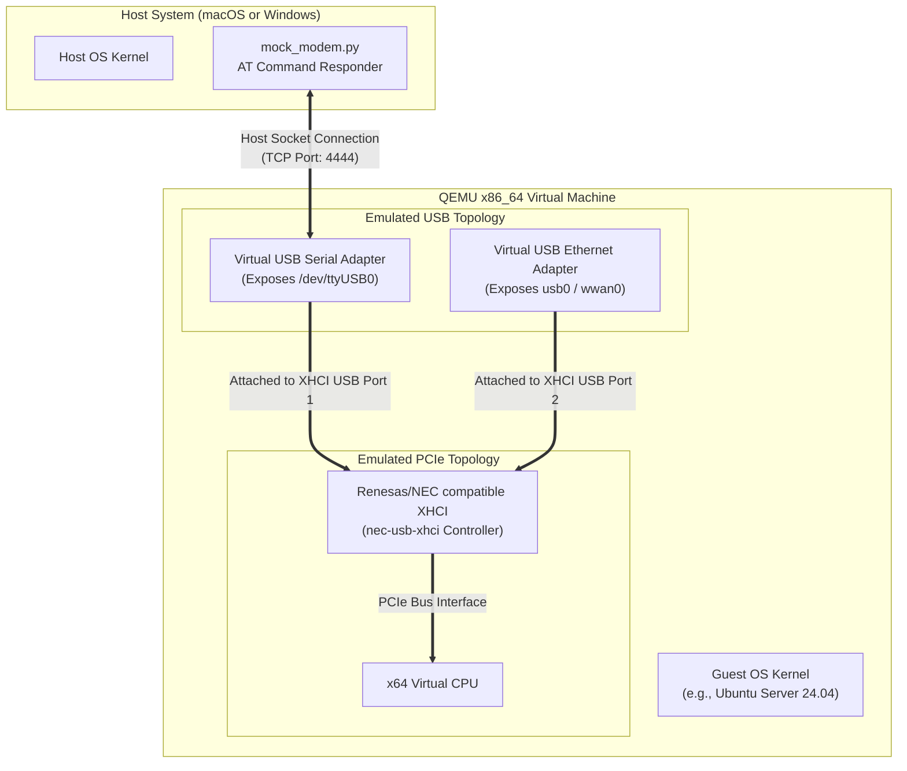

# QEMU IaC Replication: Software-Emulated x64, Renesas XHCI & Sierra Wireless Modem

This repository provides a self-contained, Infrastructure-as-Code (IaC) procedure to replicate an **x64 guest system** containing a **Renesas USB 3.0 Controller** and a **Sierra Wireless EM7590 LTE Modem** mapped in software. 

This configuration is designed to function seamlessly on both **macOS** (Intel/Apple Silicon) and **Windows** hosts, requiring **zero physical hardware** (fully emulated).

---

## 1. System Architecture (Software Emulation Mode)

The following diagram illustrates how the QEMU hypervisor creates emulated virtual components:



### Component Mapping Details

| Emulated Component | QEMU / Software Simulation Strategy | Identifiers / Drivers | Notes |
| :--- | :--- | :--- | :--- |
| **x64 CPU** | Software TCG emulation (ARM64 hosts) or HVF/WHPX hypervisor acceleration (x64 hosts). | `-machine q35` | Handles x64 code execution natively or translated. |
| **Renesas USB Controller** | Emulated NEC/Renesas XHCI USB 3.0 controller (`nec-usb-xhci`). | Vendor ID: `0x1033`<br/>Device ID: `0x0194` | Guest OS loads the native Renesas-compatible `xhci_hcd` driver. |
| **AT Command Interface** | Virtual FTDI serial controller (`usb-serial`) piped to host socket. | Mapped to host port `4444` | Exposes `/dev/ttyUSB0` in guest; connects to `mock_modem.py`. |
| **LTE Network Data** | Virtual CDC Ethernet card (`usb-net`) piped to user network. | Exposes network interface | Provides internet/WAN routing mimicking LTE data. |

---

## 2. Repository Structure

- [vm_config.env](file:///Users/denismaggiorotto/Documents/Progetti/Sunnyvale/OpenSource/repos/renesas-sierra/vm_config.env): Configuration file declaring VM resources, display parameters, and emulation mode toggles.
- [mock_modem.py](file:///Users/denismaggiorotto/Documents/Progetti/Sunnyvale/OpenSource/repos/renesas-sierra/mock_modem.py): Python responder script that runs on the host and replies to modem AT commands (e.g. `ATI`, `AT!GSTATUS?`).
- [launch.sh](file:///Users/denismaggiorotto/Documents/Progetti/Sunnyvale/OpenSource/repos/renesas-sierra/launch.sh): Shell orchestrator for macOS/Linux hosts.
- [launch.ps1](file:///Users/denismaggiorotto/Documents/Progetti/Sunnyvale/OpenSource/repos/renesas-sierra/launch.ps1): PowerShell orchestrator for Windows hosts.

---

## 3. Host Prerequisites & UEFI Boot Requirements

To successfully boot a pre-installed Ubuntu Cloud Image (`disk.qcow2`), the host must have UEFI (OVMF) firmware files installed. The launcher orchestrators will automatically detect and configure them.

### macOS Hosts
1. Install **Homebrew** from [brew.sh](https://brew.sh).
2. Install QEMU (this package automatically includes the required EDK2 UEFI code/vars firmware files at `/opt/homebrew/share/qemu/`):
   ```bash
   brew install qemu
   ```
3. Python 3.x is pre-installed (used to run `mock_modem.py`).

### Linux Hosts
1. Install QEMU and the OVMF/EDK2 package:
   - **Debian/Ubuntu**: `sudo apt install qemu-system-x86 ovmf`
   - **Arch/Manjaro**: `sudo pacman -S qemu-desktop edk2-ovmf`
   - **Fedora/RHEL**: `sudo dnf install qemu-kvm edk2-ovmf`

### Windows Hosts
1. Download and run the QEMU installer for Windows from the [QEMU official website](https://www.qemu.org/download/#windows) (which includes the UEFI code/vars files in the installation's `share` folder). Add QEMU to your System `PATH`.
2. Python 3.x is required to run the AT command mock daemon.

---

## 4. Execution Guide

To run the full software-emulated environment, choose one of the following two options to boot the VM:

### Option A: Using a Pre-Installed Ubuntu 22.04 LTS Image (Fastest)

If you want to skip the OS installation phase entirely, you can download an official pre-installed Ubuntu Cloud Image and boot it directly.

1. **Download the pre-installed disk image**:
   ```bash
   curl -L -o disk.qcow2 https://cloud-images.ubuntu.com/jammy/current/jammy-server-cloudimg-amd64.img
   ```
2. **Boot the VM directly** (this automatically starts the VM using the pre-installed disk image):
   - **On macOS / Linux**:
     ```bash
     ./launch.sh
     ```
   - **On Windows (PowerShell)**:
     ```powershell
     .\launch.ps1
     ```

> [!NOTE]
> **Automatic Cloud-Init & SSH Key Integration (macOS)**:
> When launching the VM directly (without `--iso`) on macOS, the launcher script dynamically:
> 1. Generates an SSH key pair (`vm_key` / `vm_key.pub`) in the repository root folder.
> 2. Clears conflicting cached entries for port 2222 in your host's `~/.ssh/known_hosts` file.
> 3. Creates a `cloud-init.iso` drive that configures:
>    - **Username**: `ubuntu`
>    - **Password**: `password123`
>    - **SSH Public Key**: Injects `vm_key.pub` for passwordless authorization.
>
> You can connect via SSH from your host terminal using the generated private key directly:
> ```bash
> ssh -i vm_key -p 2222 ubuntu@127.0.0.1
> ```

---

### Option B: Installing from an ISO Media

If you want to perform an interactive installation from scratch using the official Ubuntu installation media:

1. **Download the installation ISO**:
   ```bash
   curl -L -o ubuntu-22.04-live-server-amd64.iso https://releases.ubuntu.com/22.04/ubuntu-22.04.5-live-server-amd64.iso
   ```
2. **Boot the VM and mount the ISO**:
   - **On macOS / Linux**:
     ```bash
     ./launch.sh --iso ubuntu-22.04-live-server-amd64.iso
     ```
   - **On Windows (PowerShell)**:
     ```powershell
     .\launch.ps1 -IsoPath ubuntu-22.04-live-server-amd64.iso
     ```

---

### Next Step: Run the Modem Mock Daemon (on Host)

Once the VM is launched, open a separate terminal window on your host machine and start the Python script to emulate the Sierra Wireless EM7590 AT command processor:

```bash
python3 mock_modem.py
```
*The daemon will connect to QEMU's virtual serial port and start listening for AT commands.*

---

## 5. Guest Operating System Verification (Ubuntu Guest)

Once your guest OS is booted, log in and verify the emulated hardware architecture:

### 1. Verify Renesas USB 3.0 controller
```bash
lspci -nnk | grep -i xhci
```
*Expected Output:*
```text
00:1d.0 USB controller [0c03]: NEC Corporation uPD720200 USB 3.0 Host Controller [1033:0194] (rev 03)
    Kernel driver in use: xhci_hcd
```

### 2. Verify Emulated USB Devices
List all USB devices attached to the virtual bus:
```bash
lsusb -t
```
*Expected Output showing the virtual serial interface and USB network card attached to the NEC XHCI hub:*
```text
/:  Bus 02.Port 1: Dev 1, Class=root_hub, Driver=xhci_hcd/4p, 5000M
    |__ Port 1: Dev 2, If 0, Class=Vendor Specific Class, Driver=ftdi_sio, 12M
    |__ Port 2: Dev 3, If 0, Class=Communications, Driver=cdc_ether, 480M
```

### 3. Verify AT Command Communication
You can send AT queries to the virtual modem device (mapped to `/dev/ttyUSB0` or `/dev/ttyACM0`):
```bash
# Install screen or minicom to talk to the port, or use screen directly:
screen /dev/ttyUSB0 115200
```
Type `ATE1` (enable local echo) and query the modem profile:
```text
ATI
Manufacturer: Sierra Wireless, Inc.
Model: EM7590
Revision: SWI9X50C_01.14.02.00
IMEI: 359123456789012
IMEI SV: 02
+GCAP: +CGSM,+DS,+ES

OK

AT!GSTATUS?
!GSTATUS: 
Current Time:  36250      Temperature: 36
Bootup Time:   450        Mode:        ONLINE
System mode:   LTE        PS state:    ATTACHED
LTE band:      B3         LTE bw:      20 MHz
LTE Rx chan:   1650       LTE Tx chan: 19650
EMM state:     Registered Normal Service
RRC state:     RRC Connected
IMS reg state: No Srv

PCC RxM RSSI:  -64        PCC RxD RSSI:  -65
PCC LNA state: Low
PCC Tx Power:  10         TAC:         BEEF (48879)
Cell ID:       01234567 (19088743)

OK
```
*(To exit the screen session, press `Ctrl+A` then `K` and confirm with `y`.)*

---

## 6. How to Switch to Physical Hardware Passthrough

If you ever obtain a physical PCIe Renesas uPD720202 USB controller or a physical Sierra Wireless EM7590 USB dongle and want to test native hardware passthrough:

1. Open [vm_config.env](file:///Users/denismaggiorotto/Documents/Progetti/Sunnyvale/OpenSource/repos/renesas-sierra/vm_config.env).
2. Set `MOCK_MODE="false"`.
3. Save the file and restart the launcher script. The orchestrator will dynamically switch to probing and capturing the physical USB addresses instead of running the software emulators.
